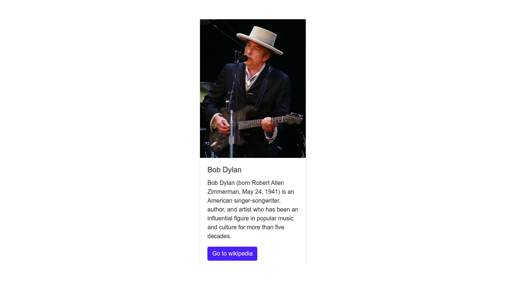

# `03` Building a layout
[](#-results)


Let's practice a little bit more about using JSX for creating HTML.

Now we have another object that is just a bit more complex than the last one.

# :speech_balloon: Instructions

You have a `data` object that contains Bob Dylans information (image, title, etc).

```js
const data = {
  image: "https://upload.wikimedia.org/wikipedia/commons/thumb/0/02/Bob_Dylan_-_Azkena_Rock_Festival_2010_2.jpg/800px-Bob_Dylan_-_Azkena_Rock_Festival_2010_2.jpg",
  cardTitle: "Bob Dylan",
  cardDescription: "Bob Dylan (born Robert Allen Zimmerman, May 24, 1941) is an American singer/songwriter, author, and artist who has been an influential figure in popular music and culture for more than five decades.",
  button: {
    url: "https://en.wikipedia.org/wiki/Bob_Dylan",
    label: "Go to wikipedia"
  }
};
```

Use the information contained in `data` to render a bootstrap card, for example: The card's title will be the `data.cardTitle`, etc.

Here is the HTML code for creating a card in bootstrap:

```html
<div class="card m-5">
  
  <div class="card-body">
    <h5 class="card-title">Card title</h5>
    <p class="card-text">Some quick example text to build on the card title and make up the bulk of the cards content.</p>
    <a href="#" class="btn btn-primary">Go somewhere</a>
  </div>
</div>
````
Source: [Bootstrap Card](https://getbootstrap.com/docs/4.0/components/card/#example)

### This is how your end result needs to look like:



[//]: # (autograding info start)
#  Results
> ⌛ Give it a minute. As long as you see the orange dot  on top, CodeBuddy is still processing. Refresh this page to see it's current status.
>
> This is what CodeBuddy found when running your code. It is to show you what you have achieved and to give you hints on how to complete the exercise.


### App

|                 Status                  | Check                                                                                    |
| :-------------------------------------: | :--------------------------------------------------------------------------------------- |
|  | Top Level `App` component should render |

### Image

|                 Status                  | Check                                                                                    |
| :-------------------------------------: | :--------------------------------------------------------------------------------------- |
|  | Card should contain Bob Dylan image |

### Link

|                 Status                  | Check                                                                                    |
| :-------------------------------------: | :--------------------------------------------------------------------------------------- |
|  | Card should have Wikipedia link |

### Title

|                 Status                  | Check                                                                                    |
| :-------------------------------------: | :--------------------------------------------------------------------------------------- |
|  | Card should have 'Bob Dylan' as title |


[🔬 Results Details](../../actions)
[🐞 Tips on Debugging](https://github.com/DCI-EdTech/autograding-setup/wiki/How-to-work-with-CodeBuddy)
[📢 Report Problem](https://docs.google.com/forms/d/e/1FAIpQLSfS8wPh6bCMTLF2wmjiE5_UhPiOEnubEwwPLN_M8zTCjx5qbg/viewform?usp=pp_url&entry.652569746=SPA-boilerplate-building-layout)


[//]: # (autograding info end)